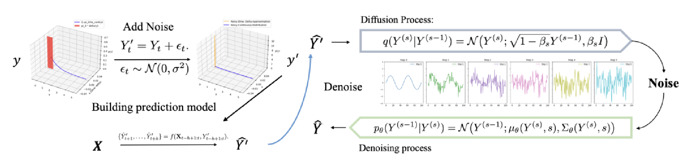

# ZIDF: Zero Inflation Diffusion Framework

**From Noise to Precision: A Diffusion-Driven Approach to Zero-Inflated Precipitation Prediction**

[](https://doi.org/10.3233/FAIA250921)
[](LICENSE)

Official PyTorch implementation of **ZIDF (Zero Inflation Diffusion Framework)** for zero-inflated precipitation forecasting, accepted at **ECAI 2025**.

## 📖 Overview

Zero-inflated data pose significant challenges in precipitation forecasting due to the predominance of zeros with sparse non-zero events. ZIDF addresses this by integrating:

1. **Gaussian Perturbation** for smoothing zero-inflated distributions
2. **Transformer-based Prediction** for capturing temporal patterns
3. **Diffusion-based Denoising** to restore the original data structure

<p align="center">
  
</p>

## 🔑 Key Features

- **State-of-the-art Performance**: Up to 56.7% reduction in MSE and 21.1% reduction in MAE compared to baseline Non-stationary Transformer
- **Robust Zero-Inflated Handling**: Explicitly designed for data with high proportion of zeros
- **Flexible Architecture**: Can integrate with various forecasting models (Transformers, etc.)
- **Comprehensive Baselines**: Includes implementations of ZIP, Hurdle, and ZIG models

## 🚀 Quick Start

### Installation

```bash
# Clone the repository
git clone https://github.com/Wentao-Gao/ZIDF-from-noise-to-precision.git
cd ZIDF-from-noise-to-precision

# Option A: Conda (recommended)
conda env create -f environment.yml
conda activate zidf

# Option B: pip
python -m venv .venv && source .venv/bin/activate
pip install -r requirements.txt
```

### Training

Train ZIDF on synthetic zero-inflated data:

```bash
python train.py \
    --use_synthetic \
    --n_samples 10000 \
    --zero_ratio 0.7 \
    --pred_epochs 50 \
    --diff_epochs 30 \
    --save_dir ./checkpoints
```

### Evaluation

Compare ZIDF with baseline models:

```bash
python evaluate.py \
    --n_samples 10000 \
    --zero_ratio 0.7 \
    --zidf_checkpoint ./checkpoints/best_model.pt \
    --save_dir ./results
```

### Using Config Files

You can reproduce experiments exactly using YAML configs:

```bash
# Synthetic (70% zeros)
python train.py --config configs/synthetic_70zeros.yaml
python evaluate.py --config configs/synthetic_70zeros.yaml \
  --zidf_checkpoint ./checkpoints/best_model.pt \
  --save_dir ./results
```

For the South Australia experiment, edit `configs/sa_precip.yaml` to point to your local NetCDF files, then run:

```bash
bash scripts/reproduce_sa.sh
```

## 📊 Results

Performance comparison on South Australian precipitation data:

| Model | Output Length | MSE | MAE |
|-------|--------------|-----|-----|
| **ZIDF (Ours)** | 24 | **0.3785** | **0.2487** |
| Non-stationary Transformer | 24 | 0.8723 | 0.2975 |
| iTransformer | 24 | 0.9018 | 0.3256 |
| ZIP | 24 | 1.5620 | 0.5612 |
| Hurdle | 24 | 1.8725 | 0.6250 |

For more detailed results, see our [paper](https://doi.org/10.3233/FAIA250921).

## 📁 Project Structure

```
ZIDF-from-noise-to-precision/
├── models/
│   ├── zidf.py                    # Main ZIDF framework
│   ├── diffusion.py               # Diffusion model (DDPM)
│   ├── non_stationary_transformer.py  # Predictive component
│   └── baselines.py               # Baseline models (ZIP, Hurdle, ZIG)
├── data/
│   ├── data_loader.py             # Data loading utilities
│   └── preprocessing.py           # Data preprocessing
├── utils/
│   ├── metrics.py                 # Evaluation metrics
│   └── visualization.py           # Plotting utilities
├── configs/                        # YAML configs for experiments
├── scripts/                        # Reproducibility scripts
├── notebooks/
│   └── demo.ipynb                 # Demo notebook
├── train.py                       # Training script
├── evaluate.py                    # Evaluation script
└── README.md                      # This file
```

## 🔧 Usage

### Using ZIDF in Your Code

```python
import torch
from models.zidf import ZIDF
from models.diffusion import DiffusionModel
from models.non_stationary_transformer import NonStationaryTransformer

# Initialize models
predictive_model = NonStationaryTransformer(
    input_dim=10,
    output_len=24,
    d_model=512,
    n_heads=8
)

diffusion_model = DiffusionModel(
    input_dim=24,
    hidden_dim=128,
    num_steps=1000
)

# Create ZIDF framework
zidf = ZIDF(
    predictive_model=predictive_model,
    diffusion_model=diffusion_model,
    alpha_noise=0.1
)

# Training
x = torch.randn(32, 48, 10)  # [batch, seq_len, features]
y_history = torch.randn(32, 48)  # [batch, seq_len]
y_target = torch.randn(32, 24)  # [batch, output_len]

predictions, y_noisy = zidf.forward_train(x, y_history, y_target)
loss = zidf.compute_loss(predictions, y_noisy)

# Inference
predictions = zidf.forward_inference(x, y_history)
```

### Generating Synthetic Data

```python
from data.preprocessing import generate_synthetic_data

features, targets = generate_synthetic_data(
    n_samples=10000,
    n_features=5,
    zero_ratio=0.7,  # 70% zeros
    gamma_shape=2.0,
    gamma_scale=0.05
)
```

## 📈 Experiments

### Synthetic Data Experiments

Study the impact of zero inflation ratio:

```bash
for zero_ratio in 0.0 0.3 0.5 0.7 0.9; do
    python train.py \
        --use_synthetic \
        --zero_ratio $zero_ratio \
        --save_dir ./results/zero_${zero_ratio}
done
```

### Noise Level Ablation

Test different noise injection levels:

```bash
for alpha in 0.001 0.01 0.1 0.2 0.5; do
    python train.py \
        --use_synthetic \
        --alpha_noise $alpha \
        --save_dir ./results/alpha_${alpha}
done
```

## 🎯 Key Components

### 1. Gaussian Perturbation

Transforms zero-inflated distributions into smooth, differentiable distributions:

```python
y_noisy = y + N(0, α × mean(y))
```

### 2. Non-stationary Transformer

Captures complex temporal dependencies while handling non-stationarity through:
- De-stationary attention mechanism
- Learnable normalization parameters (τ and δ)

### 3. Diffusion-based Denoising

Recovers clean predictions using DDPM with 1000 diffusion steps:
- Forward process: Gradually adds noise
- Reverse process: Iteratively denoises to recover original distribution

## 📚 Citation

If you find this work useful, please cite our paper:

```bibtex
@inproceedings{gao2025zidf,
  title={From Noise to Precision: A Diffusion-Driven Approach to Zero-Inflated Precipitation Prediction},
  author={Gao, Wentao and Li, Jiuyong and Liu, Lin and Le, Thuc Duy and Chen, Xiongren and Du, Xiaojing and Liu, Jixue and Zhao, Yanchang and Chen, Yun},
  booktitle={ECAI 2025},
  pages={1107--1114},
  year={2025},
  publisher={IOS Press},
  doi={10.3233/FAIA250921}
}
```

## 🤝 Contributing

We welcome contributions! Please feel free to submit a Pull Request.

## 📄 License

This project is licensed under the MIT License - see the [LICENSE](LICENSE) file for details.

## 👥 Authors

- **Wentao Gao** (University of South Australia) - *Corresponding Author* - gaowy014@mymail.unisa.edu.au
- Jiuyong Li, Lin Liu, Thuc Duy Le, Xiongren Chen, Xiaojing Du, Jixue Liu (University of South Australia)
- Yun Chen (CSIRO Environment)
- Yanchang Zhao (CSIRO Data61)

## 🙏 Acknowledgments

This work was supported by:
- ARC Discovery Project DP230101122
- University of South Australia Research Training Program (RTP) Scholarship
- CSIRO Environment Research Unit and Data61 Business Unit

## 📝 Notes

### Data Availability

The South Australian precipitation data used in this study is derived from the NCEP/NCAR Reanalysis dataset, which is publicly available at: https://www.psl.noaa.gov/data/gridded/data.ncep.reanalysis.html

### Requirements

- Python 3.9+
- PyTorch 2.0+
- CUDA 11.7+ (for GPU support)
- Optional: `conda` for `environment.yml`

### Reproducibility

- Deterministic flags and global seeds are set in `train.py` and `evaluate.py`.
- Diffusion `beta_schedule` supports `linear` and `cosine` and must match training when evaluating (`--diffusion_steps`, `--beta_schedule`).

### Known Issues

- Inference time is approximately 3× slower than standard Transformers due to iterative diffusion denoising
- Performance may degrade with extreme zero inflation (>90%)

### Future Work

- Improve inference efficiency through faster sampling strategies
- Adaptive noise scheduling based on data characteristics
- Extend to other domains with zero-inflated data (finance, healthcare, etc.)

## 🔗 Links

- [Paper (ECAI 2025)](https://doi.org/10.3233/FAIA250921)
- [NCEP/NCAR Reanalysis Data](https://www.psl.noaa.gov/data/gridded/data.ncep.reanalysis.html)
- [University of South Australia](https://www.unisa.edu.au/)

---

**Keywords:** Zero-inflated data, Precipitation forecasting, Diffusion models, Time series, Deep learning
### Official Non-stationary Transformer

You can switch the predictive component to the official Non-stationary Transformer implementation with default settings.

Options:
- Use your installed official repo/module via `--use_official_nst --nst_module <module> --nst_class <ClassName>`.
- The wrapper will adapt common forward signatures and slice to the configured `output_len`.

Install the official repo from THUML (requires git):

```bash
pip install git+https://github.com/thuml/Nonstationary_Transformers.git
```

Example (with placeholders; replace with actual module/class from the installed package):

```bash
python train.py \
  --config configs/synthetic_70zeros_official_nst.yaml \
  --use_official_nst \
  --nst_module your_official_repo.module \
  --nst_class NonstationaryTransformer
```

If not provided or import fails, the training falls back to the internal simplified NST.

### Data Preprocessing

The South Australia precipitation experiment reads NCEP/NCAR NetCDF files. Update `configs/sa_precip.yaml` with your local paths, variables, and region.

Expected steps (to be refined/expanded):
- Load variables: precipitation (e.g., `prate`) and meteorological covariates (`air`, `uwnd`, `vwnd`, `rhum`, `pres`).
- Select region bounds; compute spatial mean across lat/lon.
- Align by time; drop missing entries.
- Assemble features by concatenating periodic (annual) and linear trend features with selected variables.
- Split data 70/15/15 into train/val/test.

You can kick off the full pipeline via:

```bash
bash scripts/reproduce_sa.sh
```

We will extend this section with exact preprocessing details and any unit conversions in a future update.

### Appendix

The paper appendix is included in the repository as `ecai_Diffusion_appendix_CR_Final_.pdf`.
